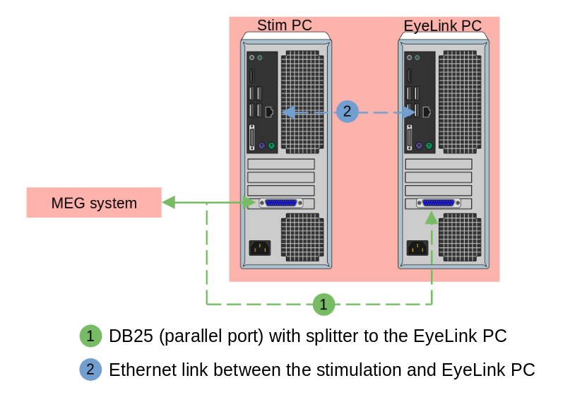
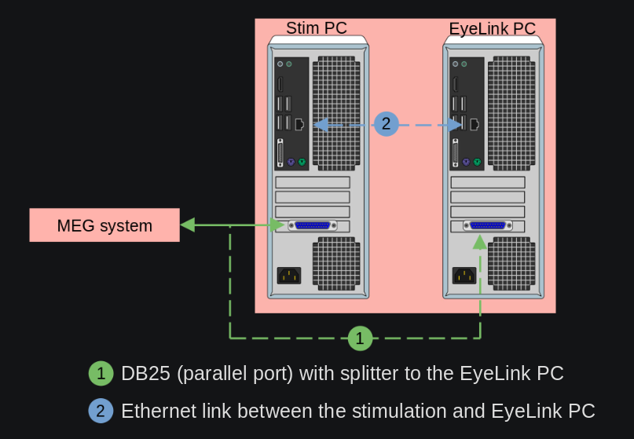

Eye-tracker
===========

The MEG is equipped with an `EyeLink 1000 Plus`_ eye-tracker from `SR Research`_. The
eye-tracker can be used in all positions:

- upright, 60° or 68°, camera below the projection screen
- supine, 0°, camera above the projection screen

Setup
-----

.. tab-set::

    .. tab-item:: Upright position

        .. image:: ../_static/eye-tracker/upright.png
            :width: 600
            :align: center

    .. tab-item:: Supine position

        .. image:: ../_static/eye-tracker/supine.png
            :width: 600
            :align: center

Triggers
--------

Triggers delivered to the MEG (see the section
:ref:`meg-triggers:Triggers from the stimulation PC`) are automatically duplicated and
delivered to the eye tracker on the ``DIN`` channel.

Alternatively, triggers can be delivered as a "message" via the ethernet link between
the :ref:`stim-pc:Stimulation PC` and the EyeLink PC.

Analogical outputs
------------------

The eye tracker is capable of sending some analogical output directly into the ``misc``
channels of the MEG, thus recording core information as part of the FIF file. In total,
6 channels are available.

.. tab-set::

    .. tab-item:: Gaze (default)

        In this mode, the channels correspond to the actual gaze position on the display
        screen. This mode requires a calibration.

        - ``0``: :math:`X_{pos}` (eye A)
        - ``1``: :math:`Y_{pos}` (eye A)
        - ``2``: Pupil size (eye A)
        - ``3``: :math:`X_{pos}` (eye B)
        - ``4``: :math:`Y_{pos}` (eye B)
        - ``5``: Pupil size (eye B)

        By default, the 3 first channels are connected to the 3 first MEG miscellaneous
        channels: ``MISC001``, ``MISC002``, and ``MISC003``. The information is encoded
        linearly on the voltage range ``(-5, 5) Volts``. For the :math:`X` and :math:`Y`
        position:

        - ``(-5, -5)`` corresponds to the top-left corner.
        - ``(0, 0)`` corresponds to the center of the screen.
        - ``(5, 5)`` corresponds to the bottom-right corner.

        .. image:: ../_static/eye-tracker/analogic-coordinates-light.png
            :width: 600
            :align: center
            :class: only-light

        .. image:: ../_static/eye-tracker/analogic-coordinates-dark.png
            :width: 600
            :align: center
            :class: only-dark

        .. warning::

            When tracking of the eye is lost, e.g. during a blink, the analogical output
            drops to the minimum ``-5V`` value.

    .. tab-item:: Raw

        This measurement is the raw pupil-center position (or pupil minus corneal if run
        in pupil-CR mode) and does not require a calibration.

    .. tab-item:: HREF

        This measurement is related to the tangent of the rotation angle of the eye
        relative to the head. For the ``-5V`` to ``5V`` range, it's
        :math:`5V * tan(angle)`, measured separately for vertical and horizontal
        rotations. This mode requires a calibration.

.. _EyeLink 1000 Plus: https://www.sr-research.com/eyelink-1000-plus/
.. _SR Research: https://www.sr-research.com/
