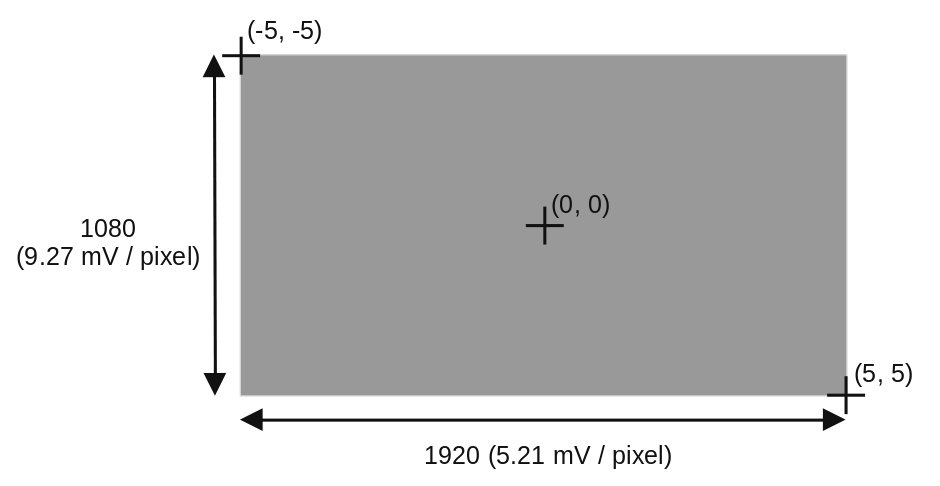
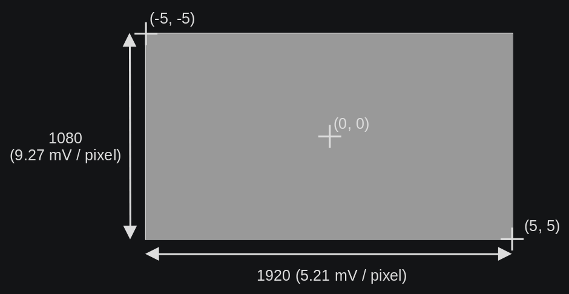

Eye-tracker
===========

The MEG is equipped with an `EyeLink 1000 Plus`_ eye-tracker from `SR Research`_. The
eye-tracker can be used in all positions:

- upright, 60° or 68°, camera below the projection screen
- supine, 0°, camera above the projection screen

Setup
-----

.. tab-set::

    .. tab-item:: Upright position

        TODO

    .. tab-item:: Supine position

        TODO

Analogical outputs
------------------

The EyeTracker is capable of sending some analogical output directly into the ``misc``
channels of the MEG, thus recording core information as part of the FIF file. In total,
6 channels are available:

- ``0``: :math:`X_{pos}` (eye A)
- ``1``: :math:`Y_{pos}` (eye A)
- ``2``: Pupil size (eye A)
- ``3``: :math:`X_{pos}` (eye B)
- ``4``: :math:`Y_{pos}` (eye B)
- ``5``: Pupil size (eye B)

By default, the 3 first channels are connected to the 3 first MEG miscellaneous
channels: ``MISC001``, ``MISC002``, and ``MISC003``. The information is encoded linearly
on the voltage range ``(-5, 5) Volts``. For the :math:`X` and :math:`Y` position:

- ``(-5, -5)`` corresponds to the top-left corner.
- ``(0, 0)`` corresponds to the center of the screen.
- ``(5, 5)`` corresponds to the bottom-right corner.

.. _EyeLink 1000 Plus: https://www.sr-research.com/eyelink-1000-plus/
.. _SR Research: https://www.sr-research.com/
