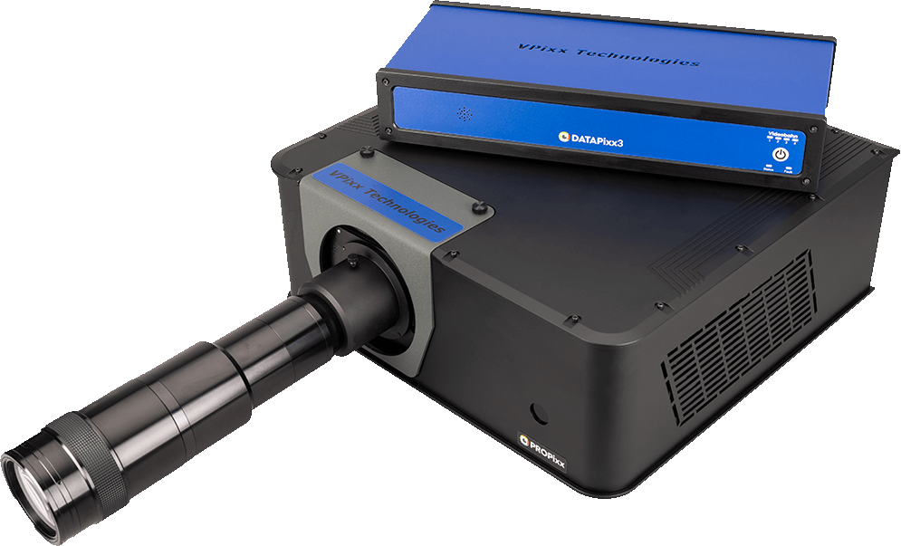
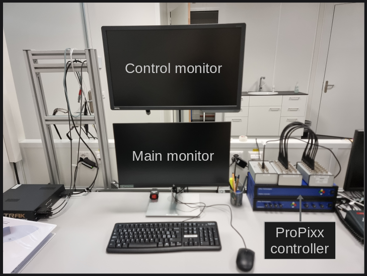
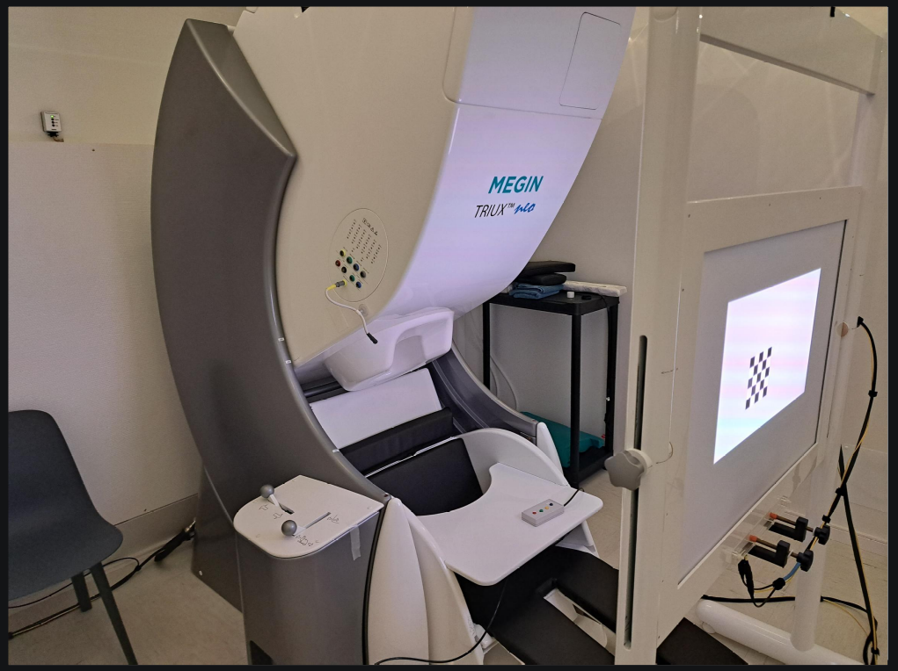

.. include:: ../links.inc

ProPixx projector
=================

Setup
-----

The MEG uses a `ProPixx projector`_ from the company VPixx to display images in the
magnetically shielded room (MSR). This projector uses LED as a light source, giving a
larger color gammut.

The projector is connected as the second monitor of the
:ref:`stimulation PC <stim-pc:Stimulation PC>`. A control monitor duplicates the image
displayed by the projector in the control room.

.. note::

    The control monitor can be used without the projector by turning ``ON`` the ProPixx
    controller while leaving ``OFF`` the projector.

The projector displays on a screen inside the MSR. The ideal screen position is marked
on the floor and ensures reproducibility between subjects.

Screen
------

The screen is position at a fixed ``~1.2m`` distance from the eyes of the subject.
The screen measures ``~30.5 cm x 55.0 cm``, thus the diagonal is ``~62.9 cm``.

Settings
--------

The projector settings can be controlled through 2 applications: ``PyPixx`` (GUI) and
``VPutil`` (command-line).

.. note::

    On Linux, the GUI-based ``PyPixx`` application is not available.

In both cases, 2 systems are available: ``PROPixxCTRL`` and ``PROPixx``. The first one
corresponds to the controller (blue box on the desk) while the second is the projector.

.. tab-set::

    .. tab-item:: PyPixx

        .. image:: ../_static/visual/pypixx.png
            :align: center
            :class: img-with-border
            :width: 800

    .. tab-item:: PyPixx (PROPixxCTRL)

        .. image:: ../_static/visual/pypixx-propixx-ctrl.png
            :align: center
            :class: img-with-border
            :width: 400

    .. tab-item:: PyPixx (PROPixx)

        .. image:: ../_static/visual/pypixx-propixx.png
            :align: center
            :class: img-with-border
            :width: 400

Projection orientation
~~~~~~~~~~~~~~~~~~~~~~

In 60° or 68° position (upright), the projector is set in ``Rear projection``. In 0°
position (supine), the projector is set in ``Ceiling mount``. In ``PyPixx``, the
orientation is set in the top bar.

LED intensity
~~~~~~~~~~~~~

The projector has been D65 calibrated for the following LED intensity: 6.25%, 12.5%,
25%, 50%, 100%. The light intensity depends on both the LED intensity and on the throw
ratio/distance.

Other LED intensity are available but require a custom white point calibration with a
target luminance which requires an `X-Rite i1Display Pro colorimeter`_.

.. note::

    Custom white point calibration might not work for very low LED intensity.

Pixel mode
~~~~~~~~~~

The ``PROPixxCTRL`` can monitor the top left pixel and emit a trigger via a BNC cable
when the top left pixel changes state. This mode, usually disable, can be found under
``Digital Output``.

.. note::

    Our connector only has a single BNC cable connected to the digital output. Thus, we
    can only monitor changes from white to black and vice versa. However, in practice,
    the color of the pixel is encoded on the digital output. Thus, a different cable
    with more than 1 BNC cable could encode a larger color space.

    In practice, most stimulation software have a mechanism to trigger right after an
    image flip (refresh). For instance, in `PsychoPy`_ a callback function can be added
    to trigger after the next image flip:

    .. code-block:: python

        from byte_triggers import ParallelPortTrigger
        from psychopy.visual import Window

        trigger = ParallelPortTrigger(0x2FB8)
        win = Window()
        win.callOnFlip(trigger.signal, 1)  # send value 1 after the next flip
        win.flip()

    Thus, the pixel mode is usually not needed.

Datasheet
---------

.. image:: ../_static/icons/pdf.png
    :align: center
    :alt: Download (SoundPixx datasheet)
    :target: ../_static/downloads/datasheet/propixx.pdf
    :width: 100
