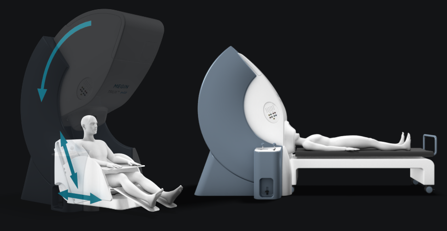
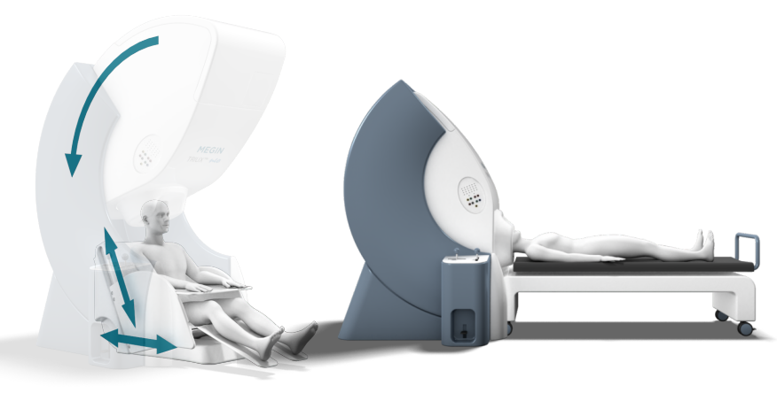
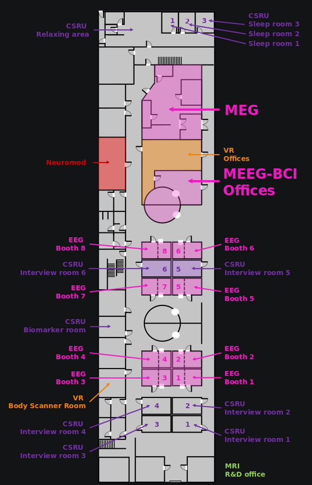
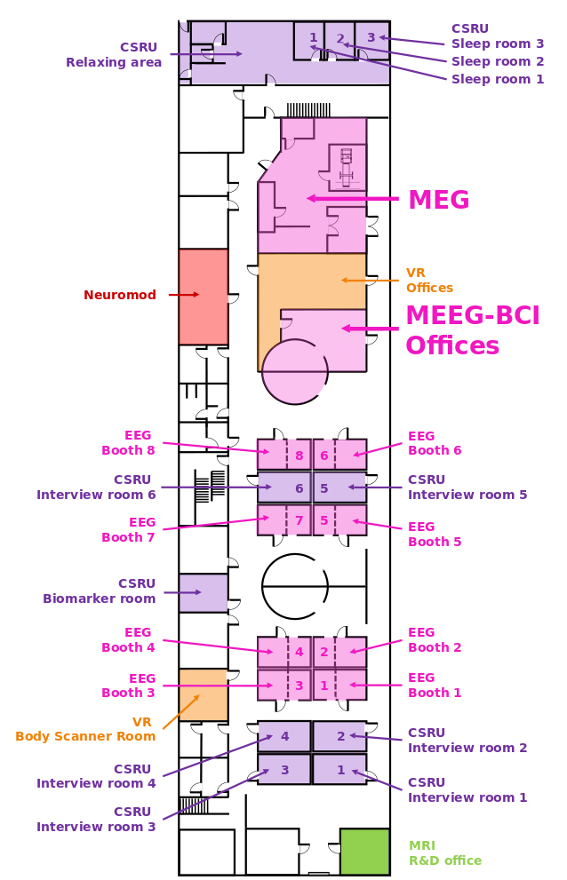

:hide-toc:

.. include:: ./links.inc

**MEG wiki**
============

.. toctree::
   :hidden:
   :caption: General

   meg-session.rst
   stim-pc.rst
   data-transfer.rst
   data-analysis-pc.rst

.. toctree::
   :hidden:
   :caption: Devices

   stim-devices/audio/index.rst
   stim-devices/visual.rst
   stim-devices/eye-tracker.rst
   stim-devices/response-pads/index.rst
   stim-devices/optimic.rst
   stim-devices/electrical-stimulator.rst

.. toctree::
   :hidden:
   :caption: Resources

   MNE-Python <https://mne.tools/stable/index.html>
   FieldTrip <https://www.fieldtriptoolbox.org/>

.. toctree::
   :hidden:
   :caption: Code

   api/index.rst
   generated/tutorials/index.rst

Wiki for the `MEGIN Triux Neo System`_ at the Human Neuroscience Platform, Campus
Biotech, Geneva. With 306 SQUID sensors, 204 planar gradiometers and 102 magnetometers,
it can measure brain activity in upright or supine position.

Where to find us
----------------

The MEEG-BCI facility is located in ``H4.01``. The main entry is in front of the
Time-out shop. Access to ``H4.01`` is restricted and requires a valid badge.

Contact us
----------

The facility can be contacted on meg@fcbg.ch and eeg@fcbg.ch depending on the modality
requested. Alternatively, you can contact directly one of the facility members:

- Gwenael Birot (manager): gwenael.birot@fcbg.ch
- Jonathan Marquis (technologist): jonathan.marquis@fcbg.ch
- Mathieu Scheltienne (engineer): mathieu.scheltienne@fcbg.ch
- Nathalie Philippe (technologist): nathalie.philippe@fcbg.ch
- Vincent Rochas (scientist): vincent.rochas@fcbg.ch

.. _MEGIN Triux Neo System: https://megin.com/triux-neo/
