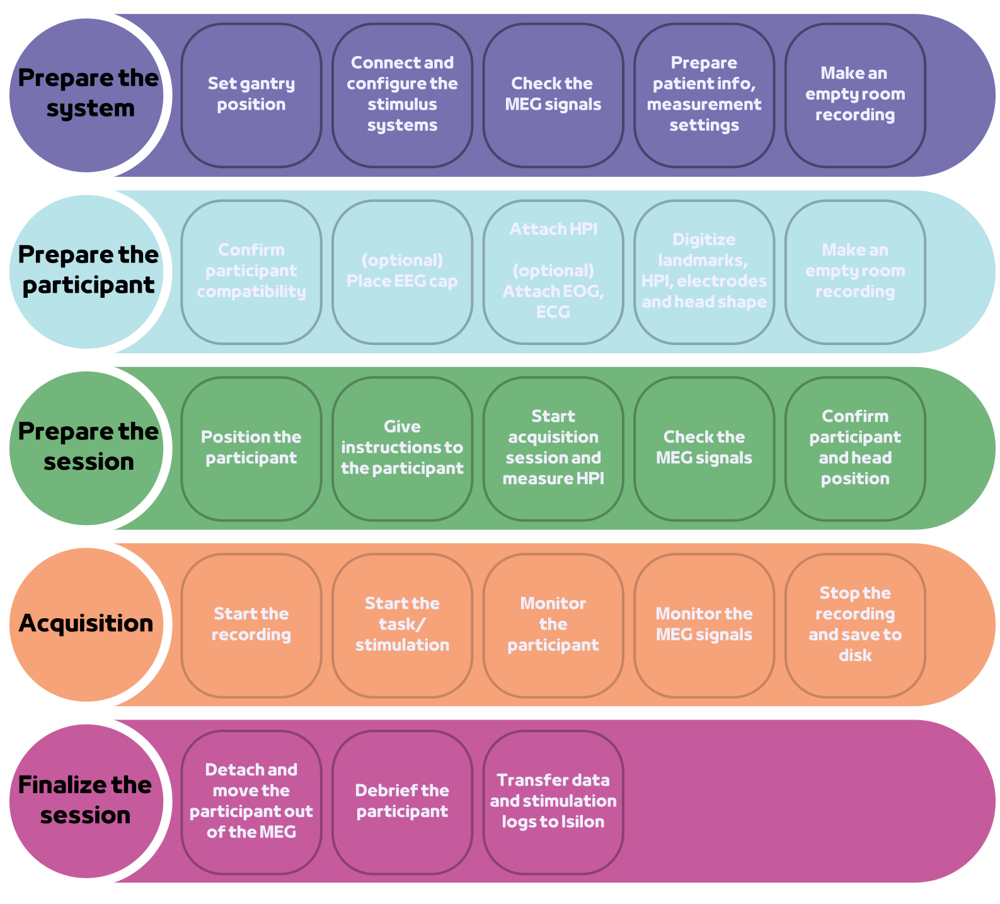
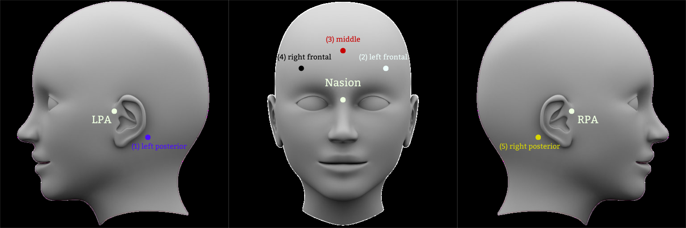
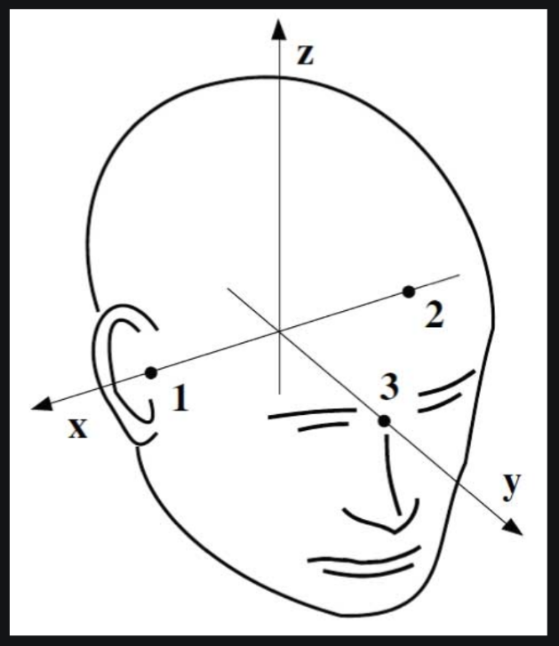

.. include:: ./links.inc

MEG session
===========

Screening
---------

An MEG session starts by screening the participant to ensure his compatibility with
MEG acquisition (see :ref:`meg-contraindications:MEG contraindications`). An MEG
measures fields in the range of :math:`fT`, i.e. :math:`e^{-15}\ Tesla`. Thus, it's very
sensitive to any magnetic metal or alloy in movement within the Magnetically Shielded
Room (MSR). For instance, the ticking of the second's needle of a mechanical watch is
picked up 2 meters from the sensors.

During screening, the participant is positioned in the MEG and the signal is monitored
for a short period of time. Screening is an iterative process where we try to identify
and remove all sources of interference. Common sources of interference are: braces,
dental retainers, piercings, make-up, bra, .. see
:ref:`meg-contraindications:MEG contraindications` for an exhaustive list.

.. note::

    Participants will change into MEG-compatible clothes thus removing belts, jeans,
    bras and other clothes with metallic pieces.

If the interference source can not be removed, e.g. implants or dental retainers, the
decision to continue or cancel the acquisition belongs to the researcher. In practice,
we recommend to exclude participants which do not yield clean signal, except if they are
part of a rare cohort. In theory, :ref:`MaxWell filtering and Spatiotemporal SSS (tSSS)
<data-analysis-pc:MaxWell filter>` can remove most noise components.

Empty-Room recording
--------------------

Before the experiment begins, an empty-room recording is measured. The empty-room
recording can be used to :ref:`re-compute the Signal Space Projectors (SSP)
<tut-artifact-ssp>`.

The default :term:`Signal Space Projectors` have been tuned for our site and the
empty-room noise present. This noise and its correction are stable in time, thus it
should not be needed to re-compute the SSPs. However, the empty-room recording can be
used to compare the :term:`SSP` correction with the empty-room noise correction from
the ``08/01/24``. On that day, the bad sensors removed are ``MEG 1213``, ``MEG 1321``,
``MEG 1343``, ``MEG 1423``.

.. code-block:: python

    from matplotlib import pyplot as plt
    from mne.io import read_raw_fif

    fname = r"empty_room_raw.fif"
    raw = read_raw_fif(fname, preload=True).apply_proj()
    fig = raw.compute_psd().plot(show=False)
    fig.axes[0].set(xlim=(0, 50), ylim=(5, 40))
    fig.axes[1].set(xlim=(0, 50), ylim=(5, 40))
    plt.show()

.. tab-set::

    .. tab-item:: Position 68°

        .. image:: ./_static/ssp/psd-68deg-dark.svg
            :align: center
            :class: only-dark
            :width: 700

        .. image:: ./_static/ssp/psd-68deg-light.svg
            :align: center
            :class: only-light
            :width: 700

    .. tab-item:: Position 60°

        .. image:: ./_static/ssp/psd-60deg-dark.svg
            :align: center
            :class: only-dark
            :width: 700

        .. image:: ./_static/ssp/psd-60deg-light.svg
            :align: center
            :class: only-light
            :width: 700

    .. tab-item:: Position 0°

        .. image:: ./_static/ssp/psd-0deg-dark.svg
            :align: center
            :class: only-dark
            :width: 700

        .. image:: ./_static/ssp/psd-0deg-light.svg
            :align: center
            :class: only-light
            :width: 700

Digitization
------------

Contrary to EEG, the head and the sensors are not in the same coordinate frame. In other
words, the sensors are fixed and the participant is free to position his head within the
helmet in different ways and to move during the recording. Thus, for 2 different
participants or 2 different recording sessions, the head position inside the MEG helmet
might vary. In other words, a given sensor will not monitor the same brain region.

To account for the variable head position, a device to head transformation is estimated
for every recording. This transformation is estimated from 5 coils placed on the
participant head. The coils position is measured both in the head coordinate frame (as
part of the digitization process) and in the device coordinate frame (as part of the
:ref:`meg-session:HPI measurement`).

The digitization process is performed with the `Polhemus FASTRAK system <Polhemus_>`_.
First, 3 :term:`anatomical landmarks` are digitized: the `nasion (NAS) <Nasion_>`_, the
`left and right pre-auricular point (LPA and RPA) <LRPA_>`_.

|

Those 3 :term:`anatomical landmarks` define the head coordinate frame:

- The X-axis goes from `LPA (2) to RPA (1) <LRPA_>`_
- The Y-axis is orthogonal to the X-axis and goes through the
  `nasion (NAS) (3) <Nasion_>`_
- The Z-axis forms the right-handed orthogonal system

|

All points digitized  after the :term:`anatomical landmarks` are reported in the head
coordinate frame. Once the head coordinate frame is defined, the digitized points are:

- the 5 :term:`HPI` coils (placement may vary from one participant to another)
- (optional) the :ref:`EEG <devices/electrophysiology:Electroencaphalography (EEG)>`
  electrodes
- the head shape (additional points on the scalp to improve co-registration)

The head shape is digitized in ``string`` mode, i.e. a continuous pressure is applied on
the pen which draws lines on the scalp.

.. note::

    The head coordinate frame measures the point's position in meters.

HPI measurement
---------------

An :term:`HPI` (Head Position Indication) measurement is always performed before a new
recording with a participant. Once, the participant is positioned in the MEG, a pulse is
sent to the 5 coils placed on the head. The coils positions are estimated from the
magnetic field measured by the MEG sensors.

.. note::

    Only 3 coils are needed to estimate the head position, 4 coils ensures that they are
    not coplanar. MEGIN opted for 5 coils as a safety margin to ensure a robust
    estimation.

The :term:`HPI` measurement at the beginning of the recording is used to estimate a
single device to head transformation, stored in the ``raw.info["dev_head_t"]`` field of
a :class:`~mne.io.Raw` object.

.. note::

    In `MNE-Python <mne stable_>`_, the device to head transformation is stored in a
    :class:`~mne.transforms.Transform` object representing a 4x4 affine transformation.

:term:`cHPI` (continuous Head Position Indication) is used to continuously elicit a
magnetic field from the 5 HPI coils. :ref:`data-analysis-pc:MaxWell filter` can use the
:term:`cHPI` signal to correct signal distortions due to head movements. See
:ref:`this tutorial <tut-cHPI>` for more information about the correction of head
movements using `MNE-Python <mne stable_>`_.

.. tip::

    In any-case, the :term:`cHPI` signal should be filtered out before the analysis.
    In `MNE-Python <mne stable_>`_, this is done through :func:`~mne.chpi.filter_chpi`.
    Note that this function is not a simple notch filter as the :term:`cHPI` signals are
    in general not stationary because the head movements act like amplitude modulators.
    Thus, an iterative fitting method is used to remove the :term:`cHPI` signal.
