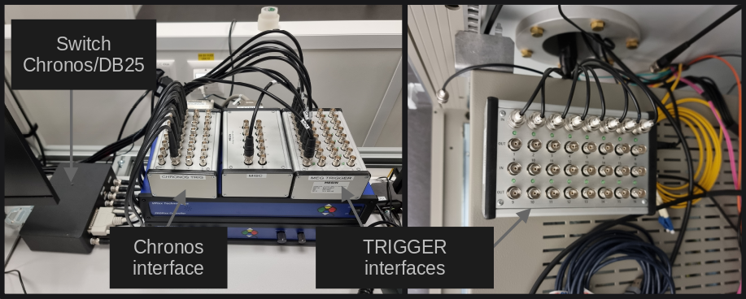

MEG triggers
============

The MEG system has 32 binary channels that can be used for triggers. Those 32 channels
are split between 2 trigger interface I/O boxes, one on the main desk connected to
the :ref:`stimulation PC <stim-pc:Stimulation PC>` and one in the stimulus cabinet.

Binary vs combined channel
--------------------------

The channels ``STI001``, ``STI002``, ..., ``STI016`` are binary channels. They measure a
single TTL pulse which drives the channel from 0 to 1 and vice versa.
The channels ``STI101`` and ``STI102`` are combined channels which measure at once the
16 binary channels associated to their respective trigger interface I/O box. The
value measured by a combined channel corresponds to the decimal value of the binary
number expressed on the binary channels. For instance, if the channels 1, 3, 4 of the
trigger interface I/O box in the stimulus cabinet receive a pulse, the combined channel
``STI101`` receives the decimal value which corresponds to the binary number ``1101``
(from left to right, channel 4 is high, channel 3 is high, channel 2 is low and channel
1 is high). In decimal, this number equals 13.

Thus, if 8 BNC cables are connected, e.g., from the computer DB-25 port (parallel port),
the combined channel can receives triggers ranging from 0 to 255 (8 bits unsigned
integer). In theory, with 16 channels each, combined channels can measure trigger
ranging from 0 to 65535 (16 bits unsigned integer).

STI101 and STI102
-----------------

``STI101`` and ``STI102`` are the names of the 2 combined channels corresponding to
each trigger interface I/O box. ``STI101`` corresponds to the one in the stimulus
cabinet and ``STI102`` to the one on the main desk. By default, both trigger interface
I/O box work in *synchronous* mode. In this mode, you effectively have only 16 binary
channels, mirrored between both boxes. In other words, if a trigger arrives on the
channel 1 of the box in the stimulus cabinet, the same trigger will be received on the
channel 1 of the box on the main desk. In this mode, you need to be certain that 2
triggers will not arrive simultaneously on both trigger interfaces.

To desynchronize the trigger interfaces, the channel ``STI102`` must be enabled. When
desynchronized, a trigger which arrives on the channel 1 of the box in the stimulus
cabinet is not mirrored on the channel 1 of the box on the main desk. When
desynchronized, the individual binary channels of the trigger interface on the main desk
are not available.

.. note::

    ``STI102`` is disabled by default and it is not possible to change the default. It
    is however possible to create the project specific settings which have to be
    reloaded at the start of every new acquisition.

Triggers from the stimulation PC
--------------------------------

The :ref:`stimulation PC <stim-pc:Stimulation PC>` can send triggers to the 8 first bits
of the trigger interface on the main desk, ``STI102``, via a parallel port (DB-25) or
via the `Chronos`_ if :ref:`stim-pc:E-Prime` is in-use. You can switch which output is
in-use with the switch Chronos/DB-25 on the main desk. See
:ref:`the trigger section of the stimulation PC <stim-pc:Triggers>` for additional
information.

Parallel Port (DB-25)
~~~~~~~~~~~~~~~~~~~~~

.. tab-set::

    .. tab-item:: Windows

        On Windows, the address of the parallel port in hexadecimal is ``2FB8``. On the
        desktop, ``LPT Port Test Utility`` can be used to test the parallel port.

        .. image:: ./_static/meg/lpt-port-test-utility.png
            :align: center
            :class: img-with-border
            :width: 400

        Select LPT X address and set ``2FB8``. You can then turn ``ON`` or ``OFF`` the
        individual ``Data Register`` pins.

        .. note::

            The ``LPT Port Test Utility`` can be downloaded
            :download:`here <./_static/downloads/triggers/LPTTestUtility.exe>`.

    .. tab-item:: Linux

        On Linux, the address of the parallel port is ``/dev/parport0``.

Chronos
~~~~~~~

With :ref:`stim-pc:E-Prime`, a `Chronos`_ can be used to deliver triggers. The Chronos
has 16 digital inputs and 16 digital outputs, wired to the Chronos interface on the
main desk. The 8 first output pins are wired to the 8 first bits of the MEG trigger
interface.
